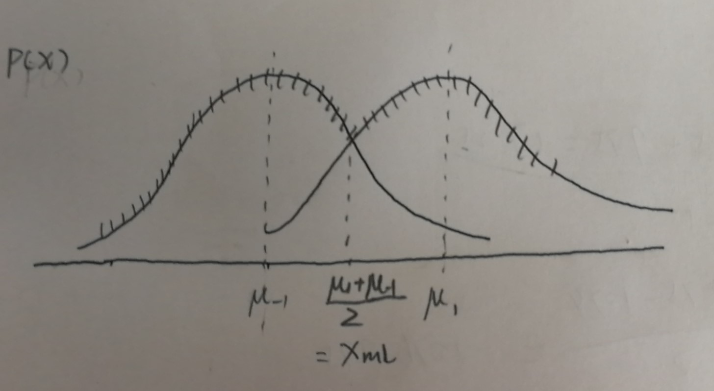

# Probability and Statistics for Machine Learning

## Likelihood Function
- **What is the Likelihood Function?**  
  - The likelihood is a function of the parameters of a statistical model. Given some results of an observation, we estimate the parameters. 
  - Suppose we have a probability function: $P(x|\theta)$, if $\theta$ is known and fixed, x is the variable, then we say $P(x|\theta)$ probability function. If $x$ is known and fixed, which means we know the result of the observation, and we would like to know about $\theta$, we say $L(\theta|x)$ likelihood function.
  - For example, we now have an unfair coin, and we don't know either the probability of $P(head)$ or $P(tail)$, but we can flip the coins for several times, here we flip 2 times. Then we get the result---suppose we get 2 Heads. Let's denote $P(head) = \theta$, then the likelihood $L(\theta|HH) = P(HH|\theta) = \theta^2$, if the reuslt is $HHT$, then $L(\theta|HHT) = \theta^2(1-\theta)$
  - How can we choose the **"Best Parameter"** based on our experiment?  
 
- **The Maximum Likelihood (ML) Estimator**
  - We should choose a parameter that maximize the prbability of the outcomes
  - $\hat{\theta} = \arg\max_{\theta}P(x|\theta)$
  - In the above situation, if the result is $HHT$, $L(\theta|HHT) = P(HHT|\theta) = \theta^2(1-\theta)$, when $\theta = \frac{2}{3}$, we have the maximum likelihood. However, if the result is $HH$, then $L(\theta|HH) = P(HH|\theta) = \theta^2$, we choose $\theta = 1$ as the estimator, since $0 \leq \theta \leq 1$, but this seems implausible.

## The Maximum a Posteriori (MAP) Estimator
- **Priori and Posteriori**  
The **prior probability** $p(y)$ is the probability of the state before we have observed it. For example, we usually beleive a coin is fair, which means $P(head) = P(tail) = 0.5$, but in some cases, this is not the truth, and therefore we need to revise our estimator based on the experiment outcomes.The revised estimator is **Posteriori Estimator**.
 

- **Example**  
Suppose for a particular event, our intuition tells us the probablity of happen is $P(happen)$ ("happen" in this case is like parameter), and after some new external information comes("Information" is like the outcome of observation), the revised probability of "happen" becomes $P(happen | information)$. In this case, we find $P(information | happen) = L(happen | inforamtion)$ is the Likelihood Function. If we combine the **Likelihood and Prior probability** and apply **Bayesian Rule**, we get: $$P(happen | information) = \frac{P(information | happen)P(happen)}{p(information)}$$
 

- **MAP**  
  - Like the Maximum Likelihood, MAP is another method to estimate the parameters. But MAP believes $\theta$ is a **Random Variable** while, in ML $\theta$ is a fixed variable.
  - Generally, **MAP** is: $$\arg\max_{\theta}P(\theta|x) = \arg\max_{\theta} \frac{P(x|\theta)P(\theta)}{p(x)}$$

# Space, Decision Rules and Loss Function

## Three Spaces
- Input Space $X$
- Action Space $A$
- Outcome Space $Y$

### The Differences of These Spaces
It is easily understanble of **Input Space**, but the differences between **Action Space** and **Outcome Space** is confusing.  
- Let's take an example: In a binary classification, we use Logistic Regression, but the final result should be 1 or 0. Thus, the action space is $\mathcal{R}_{[0,1]}$, since the range of logistic function is $\mathcal{R}_{[0,1]}$, but the outcome space is {0,1}
 

## Decision Function:
Let $x \in \mathcal{X}$, and $\mathcal{A}$ is Action space, then $$\mathcal{f} : \mathcal{X} \to \mathcal{A}$$
$$ x \mapsto f(x) $$  
is the decision function.  
 

In some notations, we call it **Decision Rules**: A $\textit{decision rule}$ $\alpha(.)$ takes input x and outputs a decision $\alpha(x)$. $\mathcal{A}$ is sometimes called the hypothesis space. In Bayes Decision Theory there are usually no restrictions placed on $\mathcal{A}$(i.e. all rules $\alpha(.)$ are allowed). In Machine Learning, we will usually put restrictions on $\mathcal{A}$ to ensure that we have have enough data to learn them

## Loss Function:
Loss function is used to evaluate an action, here $a \in \mathcal{A}$. Be careful that it is not used to evaluate the entire model.
$$\mathcal{l}: \mathcal{A}x \mathcal{Y} \to \mathcal{R}$$
$$(a,y) \mapsto \mathcal{l}(a,y)$$

# Risk and Bayes Decision Theory
The risk function combines the loss function, the decision rule, and the probabilities. More precisely, the risk of a decision rule $\alpha(.)$ is the expected loss $L(.,.)$ with respect to the probabilities $P(.,.)$:
$$\mathcal{R}(\alpha) = \sum_{x,y}L(\alpha(x),y)P(x,y)$$ this is for discrete cases, if it is continuous, substitute $\sum$ by $\int$  
 

**Bayesian Decision Rule**
$$\hat{\alpha} = \arg\min_{\alpha \in \mathcal{A}}\mathcal{R}(\alpha)$$  
 

**Re-express the Risk function**  

$$
\begin{aligned}
\mathcal{R}(\alpha) =& \sum_{x,y}L(\alpha(x),y)P(x,y)\\
=& \sum_{x}\sum_{y}L(\alpha(x),y)P(y|x)P(x)\\
=& \sum_{x}P(x)\sum_{y}L(\alpha(x),y)P(y|x)
\end{aligned}
$$
Therefore, for each $x$, the best decision function $$\hat{\alpha}(x) = \arg\min_{\alpha \in \mathcal{A}}\sum_{y}L(\alpha(x),y)P(y|x)$$

**Example**:  
Let's consider "0-1 loss":
$$
L(\alpha(x),y) = 
\begin{cases}
1, \alpha(x) \neq y\\
0, \alpha(x) = y
\end{cases}
$$
where $y \in \{-1,1\}$, what is $\hat{\alpha}(x)?$
$$
\begin{aligned}
\hat{\alpha}(x) &= \arg\min_{\alpha \in \mathcal{A}}\sum_{y}L(\alpha(x),y)P(y|x)\\
&= \sum_{y \neq \alpha(x)}P(y \neq \alpha(x)|x) + \sum_{y = \alpha(x)}P(y = \alpha(x)|x)*0\\
&= \sum_{y \neq \alpha(x)}P(y \neq \alpha(x)|x)\\
&= 1 - \sum_{y}P(y = \alpha(x)|x)
\end{aligned}
$$
which means we need $$ \sum_{y = \alpha(x)}P(y = \alpha(x)|x) = P(y = \alpha(x)|x)$$
to attain its maximum, that is we should find $$\arg\max_{\alpha}P(y = \alpha(x)|x) $$
This is **MAP** estimate!

# The Log-Likelihood Ratio and Thresholds
- Suppose we have a binary classification problem, $y \in \{1,-1\}$, and $x \in \mathcal{X}$, for any given $x$, we have $P(x|y=1)$ and $P(x|y=-1)$, which $y$ should we choose for a given $x$? We consider the Maximum Likelihood estimator, if $P(x|y=1) > P(x|y=-1)$ , we can choose $y = 1$, else we choose $y = -1$ 
- Hence for binary classification, we have $\mathit{log-likelihood}$ $\mathit{ratio}$ $\log\frac{P(x|y=1)}{P(x|y=-1)}$ and a threshold $T$, which is determinded by the prior and loss functions.  
 

Now let's express the loss function as $2\times2$ matrix, $\{L_{a,i}: a = 1,-1, i = 1,-1 \}$, where $L_{a,i} = L(\alpha(x) = a, y = i)$  
- For any **given $x$**, our goal is to find $\alpha(x)$ such that it minimize the expected loss  
 

The expected loss for decision $\alpha(x) = 1$ is given by $L_{1,1}P(y = 1|x) + L_{1,-1}P(y = -1|x)$; The expected loss for decision $\alpha(x) = -1$ is given by $L_{-1,1}P(y = 1|x) + L_{-1,-1}P(y = -1|x)$  
 

- If $\mathbb{E}[L(\alpha(x) = 1|x)] > \mathbb{E}[L(\alpha(x) = -1|x)]$, then $\hat{\alpha}(x) = -1$, otherwise, $\hat{\alpha}(x) = 1$  
After some algebra: we choose $\alpha(x) = 1$ if 

$$
\begin{aligned}
L_{1,1}P(y = 1|x) + L_{1,-1}P(y = -1|x) &< L_{-1,1}P(y = 1|x) + L_{-1,-1}P(y = -1|x)\\
(L_{1,1} - L_{-1,1})P(y = 1|x) &< (L_{-1,-1} - L_{1,-1})P(y = -1|x)\\
\frac{P(y = 1|x)}{P(y = -1|x)} &< \frac{L_{-1,-1} - L_{1,-1}}{L_{1,1} - L_{-1,1}} = T_{L}
\end{aligned}
$$
Apply Bayesian's Rule:  
$$
\begin{aligned}
\log\frac{P(y = 1|x)}{P(y = -1|x)} &= \log\frac{P(x|y = 1)}{P(x|y = -1)} + \log\frac{P(y = 1)}{P(y = -1)}\\
\log\frac{P(x|y = 1)}{P(x|y = -1)} &= \log\frac{P(y = 1|x)}{P(y = -1|x)} - \log\frac{P(y = 1)}{P(y = -1)}
\end{aligned}
$$
which combine the log-likelihood ratio with the log ratio of the prior  
Then $\hat{\alpha}(x) = 1$ provided 
$$\log\frac{P(x|y = 1)}{P(x|y = -1)} < T_{L} + T_{P}$$
where $T_{P} = - \log\frac{P(y = 1)}{P(y = -1)}$

**Example of Bayes Decision**  
Let $P(x | y)=\frac{1}{\sqrt{2 \pi} \sigma_{y}} \exp ^{-\frac{\left(x-\mu_{y}\right)^{2}}{2 \sigma_{y}^{2}}}$, $y \in \{-1, 1\}$, $P(y) = \frac{1}{2}$,  
$$
L(\alpha(x),y) = 
\begin{cases}
1, \alpha(x) \neq y\\
0, \alpha(x) = y
\end{cases}
$$
Bayes Rule:   
$\alpha(x)=\underset{y \in\{-1,1\}}{\arg \min }\left(x-\mu_{y}\right)^{2}$,  
we can draw $P(x | y = 1)$ and $P(x | y = -1)$ respectively.  

 

As the figure shows, $x_{ml} = \frac{\mu_{1} + \mu_{-1}}{2}$, if $x < x_{ml}$, decision rule is $\hat{y}_{ml} = -1$, otherwise $\hat{y}_{ml} = 1$  
 

Now suppose $\vec{x}$ is a vector in two dimension  
$p(\vec{x} | y)=\frac{1}{2 \pi \sigma^{2}} \exp ^{-\frac{1}{2 \sigma^{2}}\left|\vec{x}-\mu_{y}\right|^{2}}$,  
To get the decision boundary, we solve:  

$$
\begin{aligned}
\left(\vec{x}-\mu_{1}\right)^{2}&=\left(\vec{x}-\mu_{-1}\right)^{2}\\
2\vec{x}\cdot(\mu_1 - \mu_{-1}) &= (|\mu_1|^2 - |\mu_{-1}|^2)
\end{aligned}
$$  
The decision rule classifies all points $\vec{x}$ above the line (i.e.$2 \vec{x} \cdot\left(\mu_{1}-\mu_{-1}\right)>\left|\mu_{1}\right|^{2}-\left|\mu_{2}\right|^{2}$) as $\hat{y} = 1$  
 

Now suppose the distributions are Gaussian but with differenct covariances  
$$p(\vec{x} | y)=\frac{1}{2 \pi\left|\sum_{y}\right|^{1 / 2}} \exp(-\frac{1}{2}\left(x-\mu_{y}\right)^{T} \sum_{y}^{-1}\left(x-\mu_{y}\right))$$
where $\Sigma_y$ is the covariance matrix.  
Then the decision boundary is defined by a curved surface which obeys:
$$\frac{1}{2}\left(x-\mu_{1}\right)^{T} \sum_{1}^{-1}(x - \left.\mu_{1}\right)-\frac{1}{2}\left(x-\mu_{-1}\right)^{T} \sum_{-1}^{-1}\left(x-\mu_{-1}\right)+\frac{1}{2} \log \left|\sum_{1}\right|-\frac{1}{2} \log \left|\sum_{-1}\right|=0$$

## Bayes Decision Theory: multi-class and regression
- $y \in \{-1,1\}$ : binary classification
- $y \in \{1,2,3,...M\}$ : multi-class classification
- $y \in \mathbb{R}$ : regression 

**Bayese Decision Rule also applies in the above cases.**

# The Strengths and Weaknesses of Bayes Decision Rule

Bayes Decision Rule is a theoretically ideal decision procedure, but in practice it can be difficult to apply due to some limitations.
You can apply Bayes Decision Rule if:
- You know $P(x|y), P(y), L(..)$  
- You can compute $\hat{\alpha} = \arg\min_{\alpha}\mathcal{R}(x)$
- You can afford the losses (e.g. gambling, poker) 
- The future is the same as the past

However,  we usually do not know the distribution $P(x|y)P(y)$

## Empirical Risk
- Let $\mathcal{X}_N = \{(x_1, y_1), (x_2, y_2)..., (x_N, y_N)\}$ be our data, we define **empirical risk** $R_{emp} = \frac{1}{N}\sum_{i = 1}^{N}L(\alpha(x_i), y_i)$, which is the average loss of our dataset.  
- A fundamental assumption of BDT and ML is that the observed data X consists of independent identically distributed i.i.d samples from an (unknown) distribution $P(x, y) = P(x|y)P(y)$, then as $N \rightarrow \infty$, $\mathcal{R}_{emp}(\alpha, \mathcal{X}_N) \to \mathcal{R}(\alpha)$

## Memorization & Generalization
It is possible $\mathcal{R}_{emp}(\alpha, \mathcal{X}_N)$ is small while $\mathcal{R}(\alpha)$ is big, which means the model fit well in the given dataset but it does not generalize well. 
 

Let's make a analogy, it seems like a student who work very hard in passing exam by reciting every questions he has met, but he does not know the answer to the questions that he never met. If he has recited sufficient many questions (i.e. $N \to \infty$), he will perform well in the exam, because almost every question in the exam he has met before and knows the answer. But if he does not recite so many questions, he might perform well because the question in the exam are what he has never seen.  
 

To solve this type of problem, we will discuss later.
